# Secure Remote Work Workshop

## Overview

The Secure Remote Work Workshop was released in response to COVID-19 to enable you to deliver rapid deployment and adoption engagements to facilitate business continuity for your customers. Use this workshop to help empower customers to stay connected, while maintaining security and control.

The Secure Remote Work Workshop is intended to be delivered as one-day engagement that includes:

Understanding the customer objectives and workloads to be enabled or optimized for remote work.
Evaluating options and implications to enable remote work scenarios.
Developing joint deployment plans and recommended next steps.

## Register for the lab 
If you have been provided with a Microsoft Hands-on Labs environment for this workshop through a registration link and an activation code, please continue to registration and activate the lab.

Navigate to the registration link, provide the required details and click on **Submit**.

<kbd>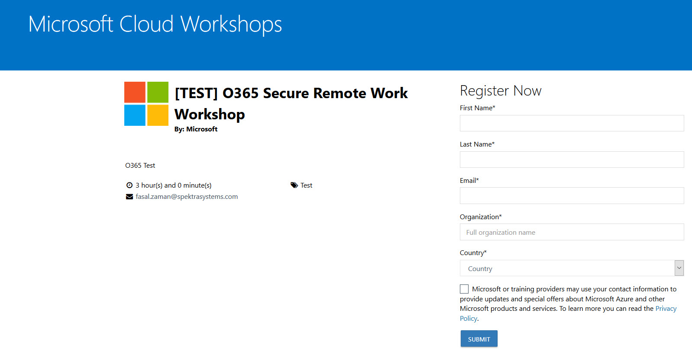</kbd>

Then click on **Launch lab** to start deploying your environment.

<kbd>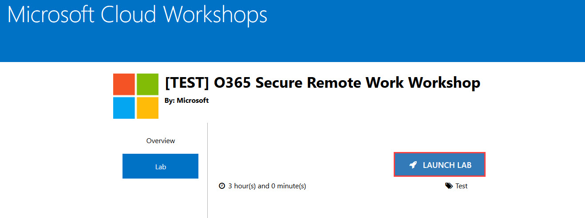</kbd>

Once the environment is provisioned, a screen with all the appropriate lab credentials will be presented. 

<kbd>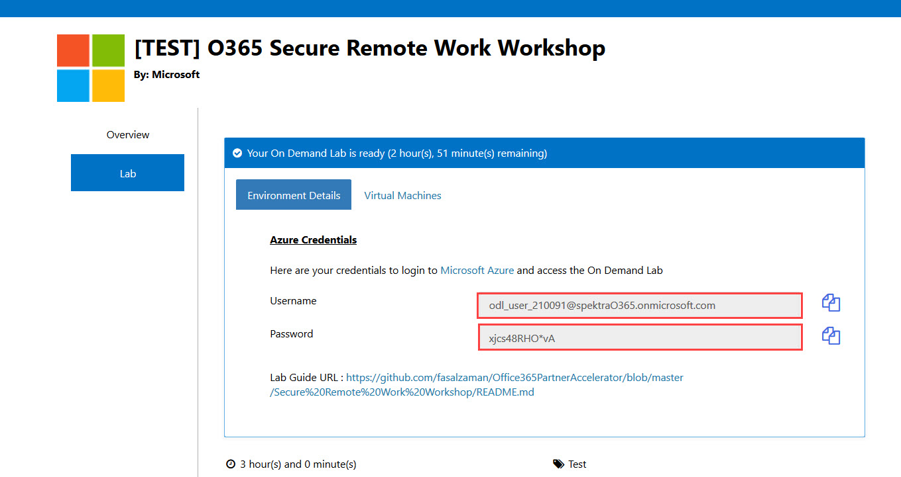</kbd>

## Exercise 1 : Enable cloud or hybrid Identity 

Since we don't have any on-premise infrastructure, we will continue with Cloud identity only.
Now login to Microsoft 365 Admin Center https://admin.microsoft.com/ using the credentials provided in the environment details page. You are the having **Global Administrator** privilege on the Tenant and an Office 365 License to access various Apps.
Microsoft 365 Admin Centre will look like this :

<kbd>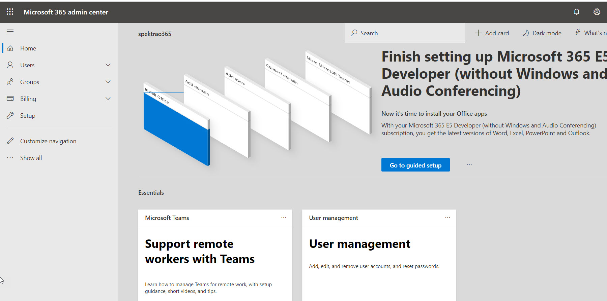</kbd>

Now lets try accessing teams for this user.

Open Teams online https://teams.microsoft.com/go# and sign-in using new user's credentials.

<kbd></kbd>

### Task 1 : Add a new user user with license assigned

Select **Active Users** under **User** tab to see all the active users in this tenant.

<kbd>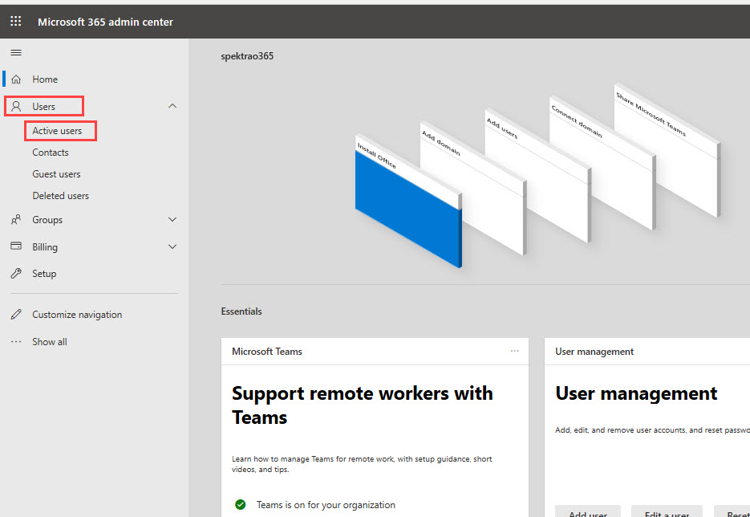</kbd>

To add a new user, Click on **Add a User** button.

<kbd>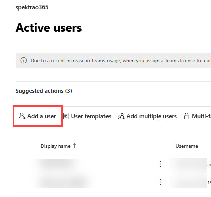</kbd>

In the Basics window that appear, provide the required details and click on **Next** 

<kbd>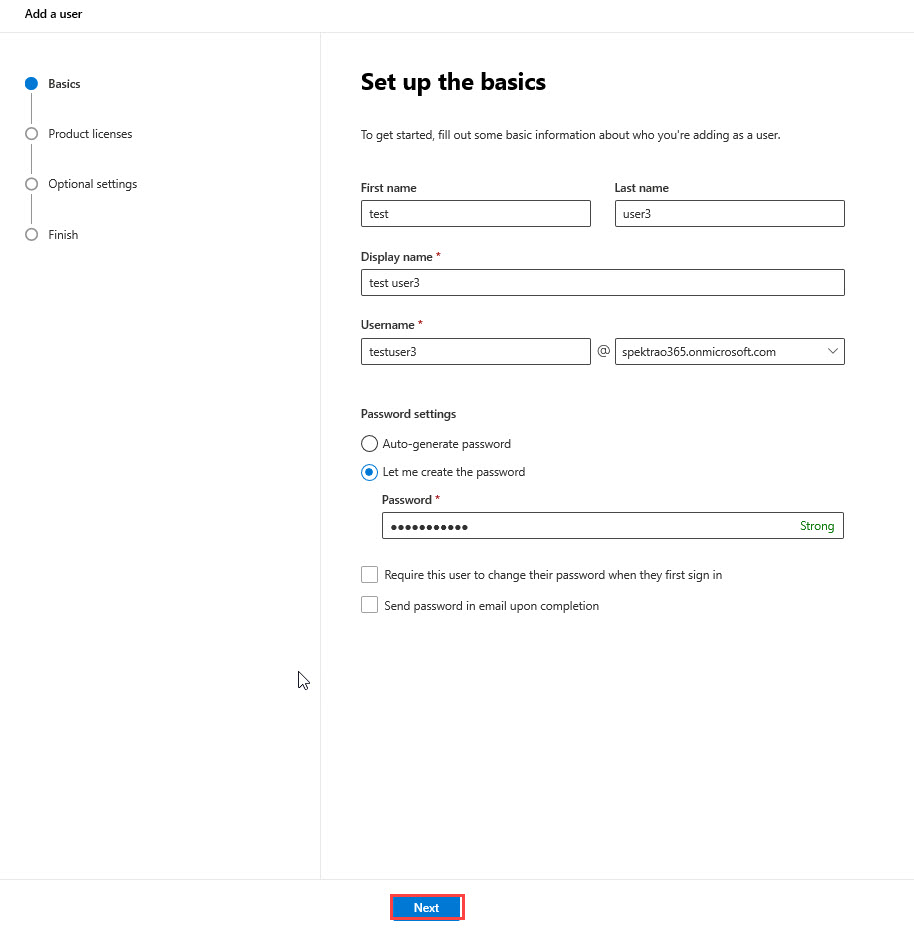</kbd>

In the Product License window, Select **Assign User a Product license** and check the box near Microsoft 365 license. Then, Click on **Next**.

<kbd>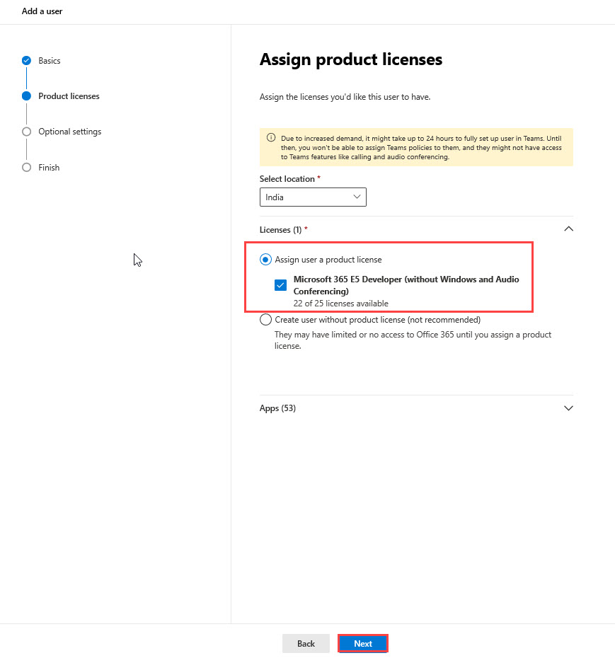</kbd>

In the optional window setting that appear, click on **Next**.

<kbd>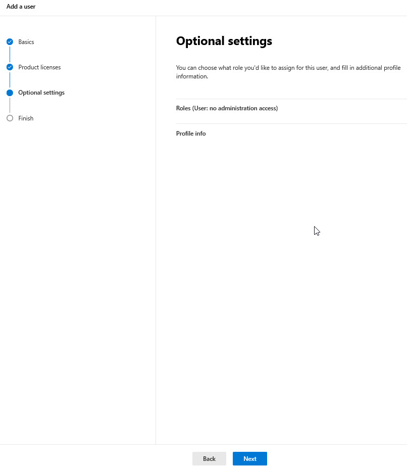</kbd>

In the next wind Click on **Finish adding** to create a new user 

<kbd>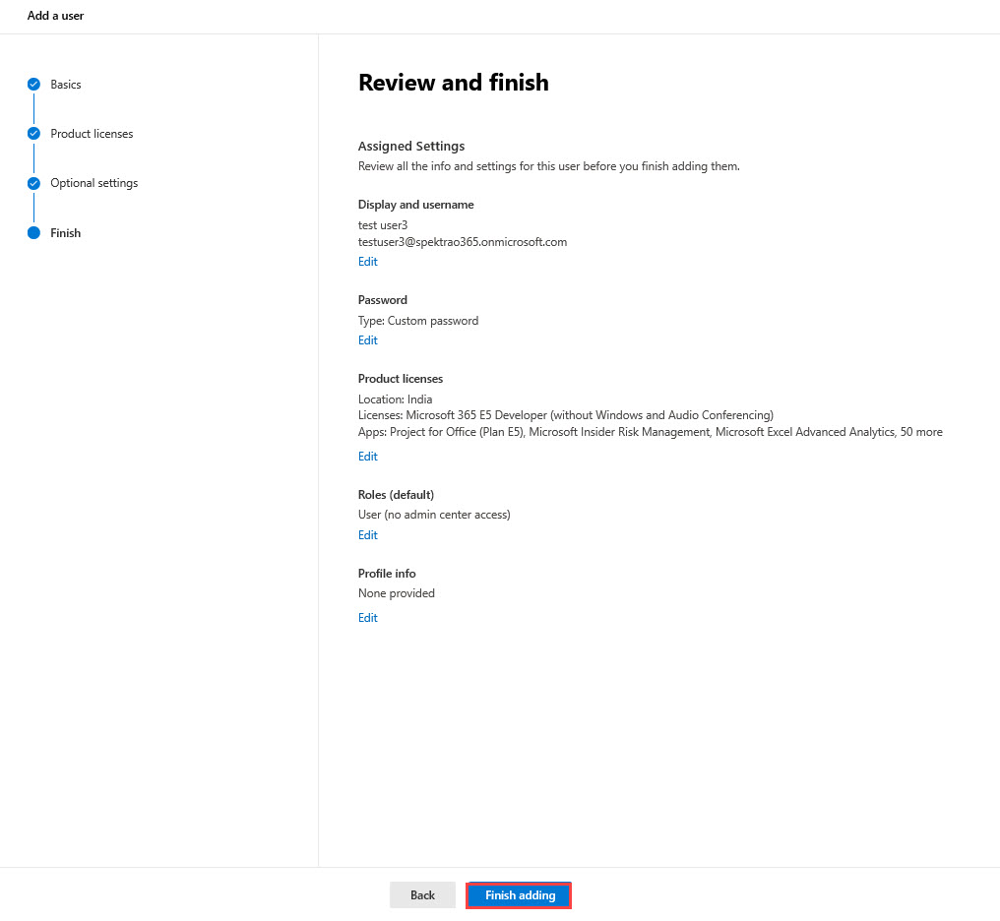</kbd>

https://docs.microsoft.com/en-us/microsoft-365/admin/add-users/add-users?view=o365-worldwide

### Task 2 : Get Teams Ready for New User

Open Teams online https://teams.microsoft.com/go# and sign-in using new user's credentials.

<kbd></kbd>

Now you have teams ready for 2 users. 

## Exercise 2 : Configure Teams

For configuring teams you can navigate to **Microsoft Teams Admin Center**. 

For that click on **Show All** button and Select **Teams** under **Admin Centers** menu.

<kbd>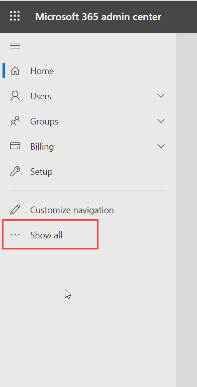</kbd>
<kbd>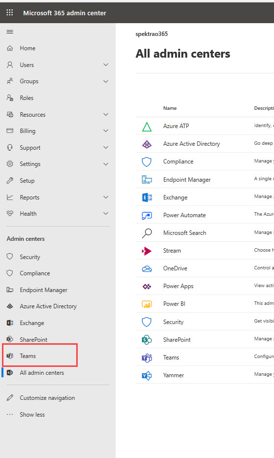</kbd>

Microsoft Teams Admin Center will look like this :

<kbd>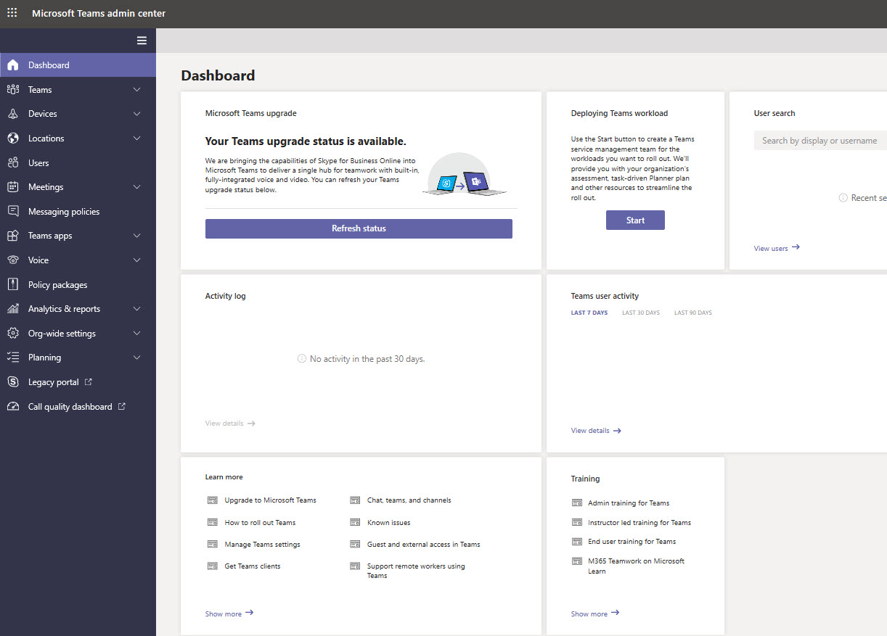</kbd>

### Task 1 : Manage Microsoft Teams settings for your organization

https://docs.microsoft.com/en-us/microsoftteams/enable-features-office-365

### Task 2 : Configure Teams Messaging setting 

https://docs.microsoft.com/en-us/MicrosoftTeams/messaging-policies-in-teams

<kbd>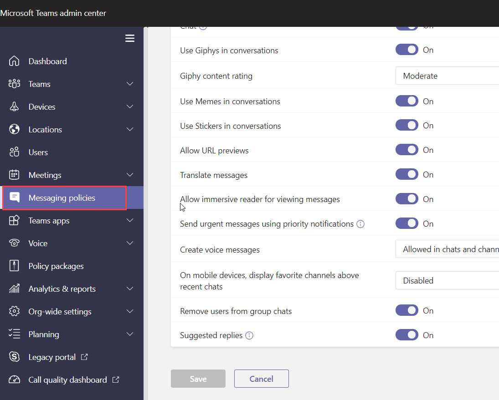</kbd>

### Task 3 : Managing External and Guest Access in Teams

https://docs.microsoft.com/en-us/MicrosoftTeams/manage-external-access
https://docs.microsoft.com/en-us/MicrosoftTeams/guest-access

<kbd>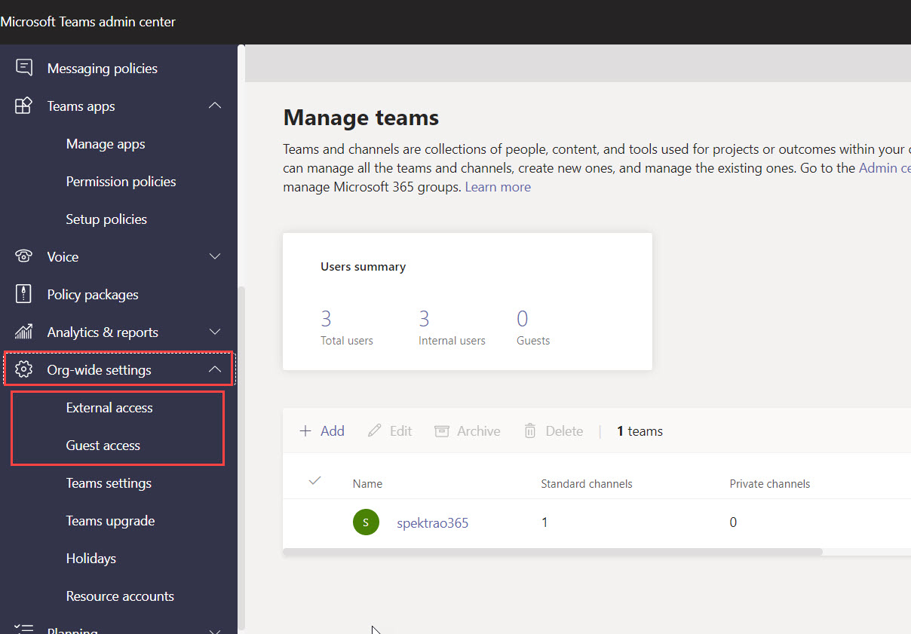</kbd>

### Task 4 : Manage Meeting policies in Teams

https://docs.microsoft.com/en-us/microsoftteams/meeting-policies-in-teams

### Task 5 : Manage Apps in Microsoft Teams

https://docs.microsoft.com/en-us/MicrosoftTeams/manage-apps

<kbd>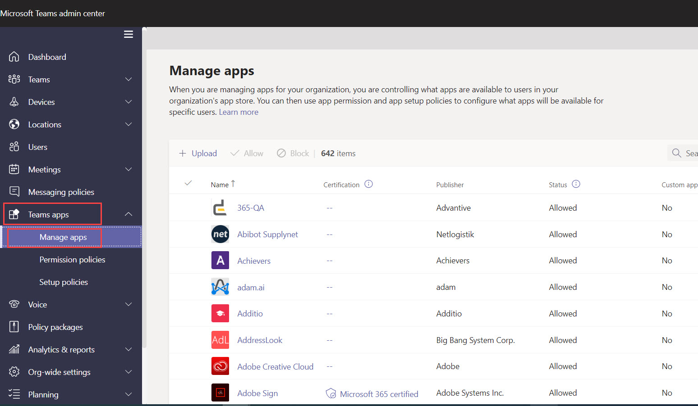</kbd>

## Exercise 3 : Secure Access to Teams

### Implement MFA with Conditional Access policies for end users

https://docs.microsoft.com/en-us/microsoft-365/admin/security-and-compliance/set-up-multi-factor-authentication?view=o365-worldwide

<kbd>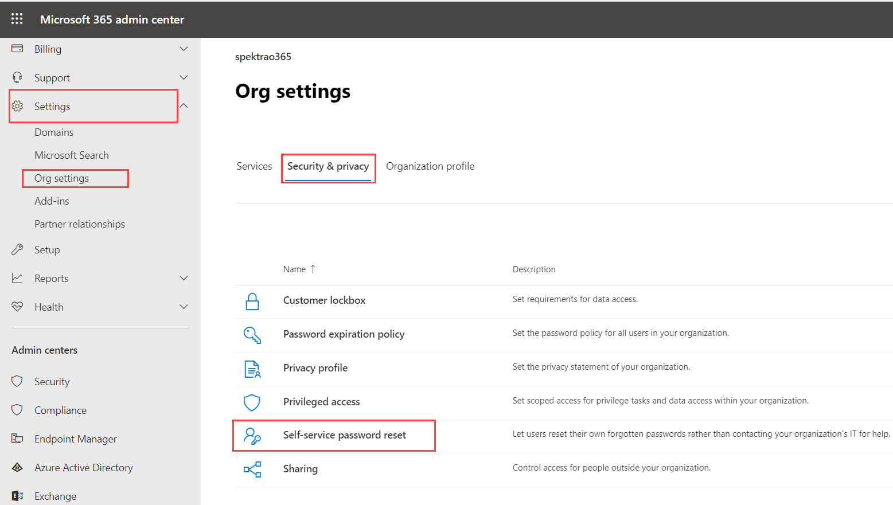</kbd>
